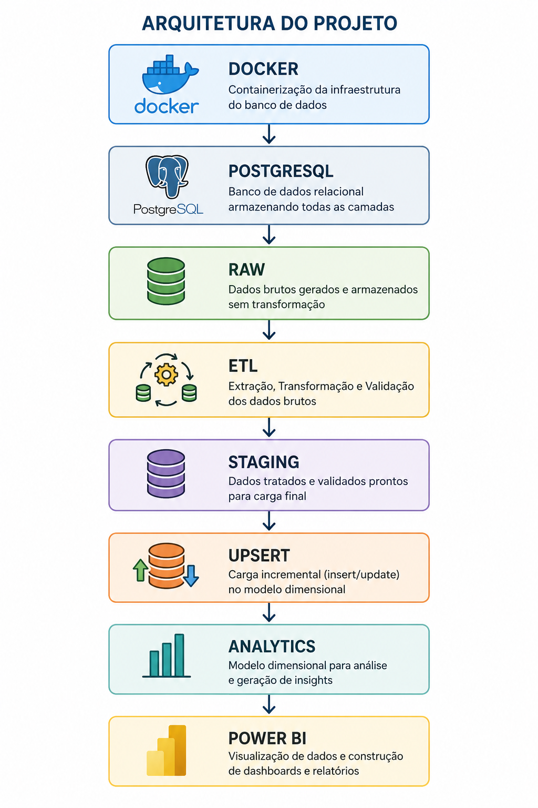
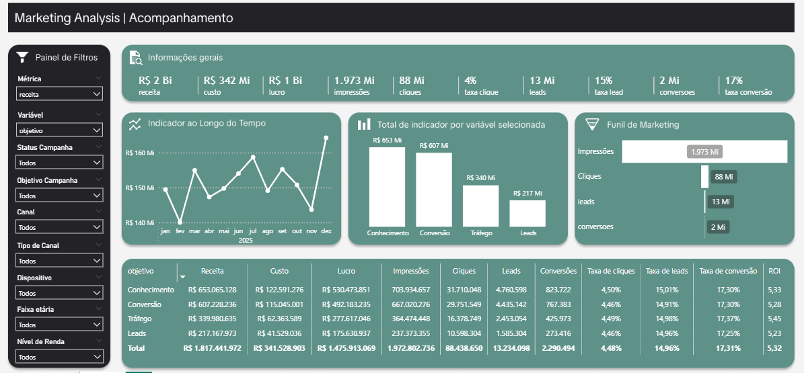

# 🚀 Marketing Analytics Pipeline

## 💡 Resumo do projeto

Projeto de Analytics Engineering desenvolvido para simular um ambiente corporativo de marketing digital, contemplando geração de dados, armazenamento em PostgreSQL, processamento ETL incremental em Python, validação de dados, carga em modelo dimensional e visualização em Power BI.

O projeto foi construído aplicando conceitos de Engenharia de Dados e Analytics Engineering, incluindo Docker, PostgreSQL, Pandas, SQLAlchemy, Pandera, Pytest, Staging Layer, Incremental Load e Upsert.

---

## 🏗️ Arquitetura da Solução



```text
Docker
 ↓
PostgreSQL
 ↓
RAW
 ↓
ETL
 ↓
STAGING
 ↓
UPSERT
 ↓
ANALYTICS
 ↓
POWER BI
```

---

## ❓ Problema de Negócio

Empresas que investem em marketing digital precisam acompanhar continuamente o desempenho de campanhas, canais, públicos e regiões para maximizar o retorno sobre investimento (ROI).

O objetivo deste projeto é transformar dados brutos de campanhas em informações confiáveis para responder perguntas como:

- Quais campanhas geram mais receita?
- Quais canais possuem melhor ROI?
- Quais públicos convertem melhor?
- Como está a evolução das receitas ao longo do tempo?
- Em quais etapas do funil estamos perdendo mais clientes?

---

## 📊 Modelo de Dados

### Dimensões

| Tabela |
|----------|
| dim_data |
| dim_canal |
| dim_campanha |
| dim_regiao |
| dim_dispositivo |
| dim_publico |

### Fato

| Tabela |
|----------|
| tb_analytics_marketing |

### Métricas

- Impressões
- Cliques
- Leads
- Conversões
- Custo
- Receita
- Taxa de cliques
- Taxa de Conversão
- CPC
- ROI

---

## 🔄 Pipeline ETL

### Extração

Leitura dos dados da camada RAW.

### Transformação

- Padronização de canais
- Padronização de dispositivos
- Tratamento de datas
- Conversão de valores monetários
- Tratamento de valores nulos
- Remoção de duplicidades
- Remoção de métricas inválidas
- Criação de métricas derivadas
- Lookup das chaves dimensionais

### Validação

Validação de dados utilizando Pandera:

- Tipagem
- Valores mínimos
- Consistência dos dados

### Carga

- Staging Layer
- Upsert SQL
- Atualização incremental da camada Analytics

---

## 🛠️ Tecnologias Utilizadas

### Banco de Dados

- PostgreSQL 16
- Docker

### Engenharia de Dados

- Python
- Pandas
- NumPy
- SQLAlchemy
- Faker

### Qualidade de Dados

- Pandera

### Visualização

- Power BI

---

## 📈 Dashboard

O dashboard foi desenvolvido para responder perguntas de negócio relacionadas ao desempenho das campanhas de marketing.

### Página Executiva

- Receita Total
- Custo Total
- ROI
- Conversões

### Performance de Marketing

- Receita por Canal
- ROI por Canal
- CPC por Canal
- Taxa de Conversão por Canal

### Campanhas

- Top 10 Campanhas por Receita
- ROI por Campanha
- Receita vs Custo

### Público

- Receita por Faixa Etária
- Receita por Gênero
- Receita por Nível de Renda

### Geografia

- Receita por Estado
- Receita por Cidade

### Funil de Marketing

```text
Impressões
 ↓
Cliques
 ↓
Leads
 ↓
Conversões
```

### Monitoramento ETL

- Última execução
- Último ID processado
- Status da execução

---

## 📸 Dashboard

### Visão Geral



---

## 📁 Estrutura do Projeto

```text
2-MARKETING_ANALYTICS/

├── config/
│   ├── .env
│   ├── .env.example
│   ├── config.py
│   ├── db.py
│   ├── logger_config.py
│
├── docs/
│   ├── arquitetura.png
│   └── dashboard.png
│   ├── modelo_star_schema.png
│   ├── cores.txt
|
├── docker/
│   ├── docker-compose.yml
│   ├── init.sql
│
├── etl/
│   ├── extract.py
│   ├── transform.py
│   ├── validations.py
│   ├── load.py
│   ├── pipeline.py
│
├── generators/
│   ├── gerar_tb_dimensao.py
│   ├── gerar_tb_fato.py
│   ├── gerar_tb_fato_incremental.py
│
├── sql/
│   ├── ddl/
│   ├── control/
│   ├── load/
│
├── testes/
│   ├── teste.py
│
├── utils/
│   ├── carregar_sql.py
│   ├── controle.py
│   ├── dados_sujos.py
│   ├── gerador_dimensao.py
│   ├── gerador_fato.py
│   ├── gerador_metricas.py
│
├── requirements.txt
├── README.md
```

---

## 🚀 Como Executar

### 1. Clonar o repositório

```bash
git clone https://github.com/glaubermateus/Engenharia_Dados.git

cd Engenharia_Dados/2-MARKETING_ANALYTICS
```

### 2. Instalar dependências

```bash
pip install -r requirements.txt
```

### 3. Configurar variáveis de ambiente

Criar um arquivo `.env` baseado no `.env.example`.

```env
DB_HOST=localhost
DB_PORT=5437
DB_NAME=marketing_dw
DB_USER=admin
DB_PASSWORD=admin
```

### 4. Subir o PostgreSQL

```bash
docker compose up -d
```

### 5. Gerar dimensões

```bash
python generators/generate_dimensions.py
```

### 6. Gerar dados RAW

```bash
python generators/generate_raw.py
```

### 7. Executar ETL

```bash
python -m etl/pipeline
```

---

## 🔍 Principais Conceitos Aplicados

- Data Warehouse
- Modelagem Dimensional
- ETL
- Incremental Load
- Upsert
- Staging Layer
- Data Validation
- Testes Automatizados
- Observabilidade
- Analytics Engineering

---

## 📌 Melhorias Futuras

- Implementação com Apache Airflow
- Transformações utilizando DBT
- Data Quality automatizada
- Integração CI/CD
- Deploy em Cloud
- Monitoramento de Pipeline

---

## 👨‍💻 Autor

### Glauber Cruz

GitHub:

https://github.com/glaubermateus

Repositório:

https://github.com/glaubermateus/Engenharia_Dados/tree/main/2-Analytics_Engineer_Marketing
